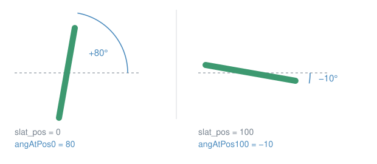
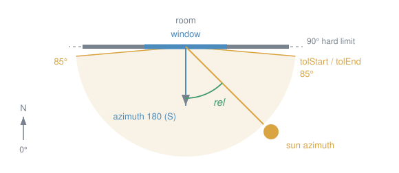
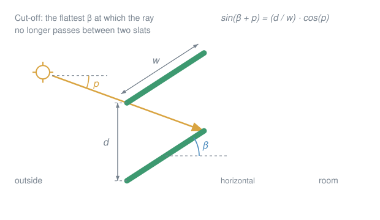
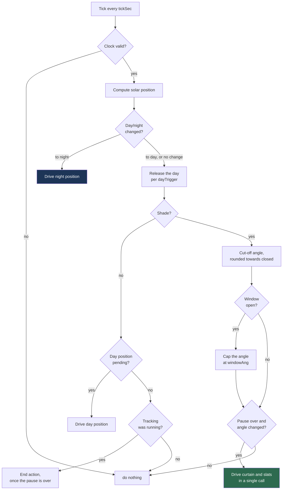
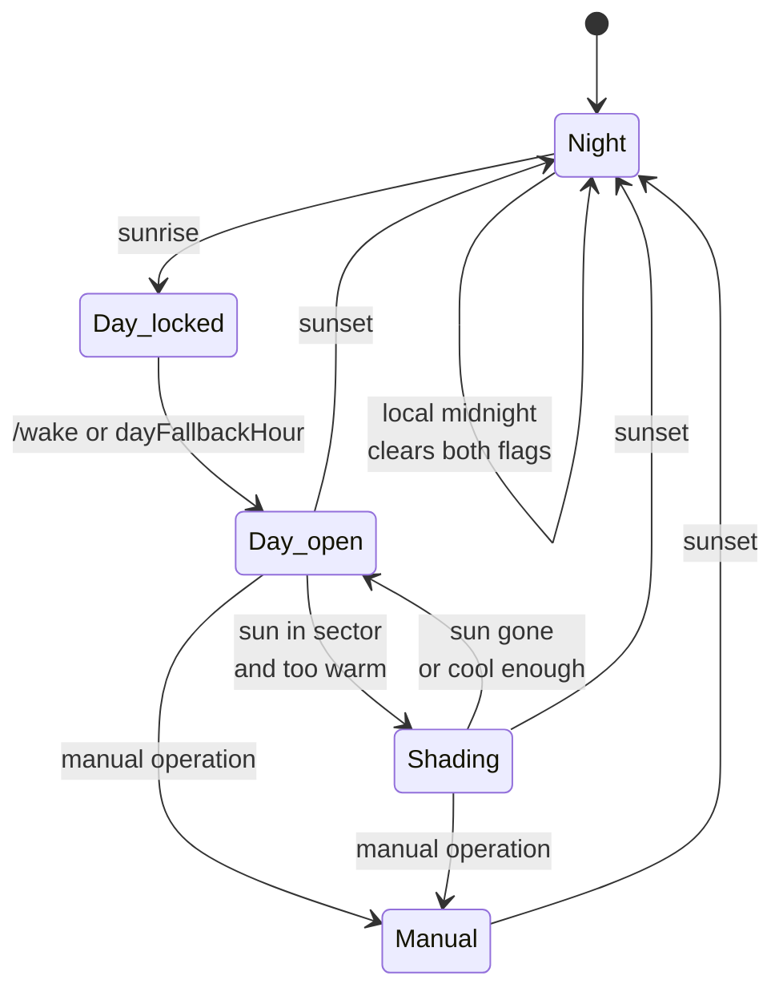

# Shelly Sun Tracking Blinds

Autonomous blind control as a Shelly script. The device computes the solar position itself, derives the slat angle that blocks direct sunlight, and tracks it through the day. 

> [!NOTE]
> No server, no broker, no cloud.

## What it uses

| Input | Comes from | Effect |
|---|---|---|
| **Sun position** | computed on the device, from clock and coordinates | sets the slat angle |
| **Room temperature** | your smart home, via `/demand` | whether to shade at all |
| **Alarm clock** | your smart home, via `/wake` | releases the day, blind opens |
| **Window contact** | your smart home, via `/window` | keeps a gap in the slats for the air |
| **Manual operation** | the button, app or web interface, at any moment | pauses automation until midnight, the night position aside |

Only the sun position is required. Every other input is optional, has a fallback, and reaches the device as a plain yes/no over HTTP. The Shelly stays the only controller: **no schedule on your smart home platform may write to the same cover**, or the script cannot tell an automation from a manual command and locks itself out for the day.

## Quick start

1. Enable the Cover profile and calibrate the blind
2. Enable slat control and set the tilt time
3. Under *Scripts*, create a new script and paste [`shading.js`](shading.js)
4. Adjust `CFG`, at minimum coordinates, `azimuth` and the slat dimensions
5. Run the [calibration](#calibration)
6. Start the script and enable *Run on startup*

## Calibration

To calibrate the slat positions, 2 values must be measured:
- Angle when slats are fully closed `angAtPos0`
- Angle when slats are fully open `angAtPos100`



Drive `slat_pos` to each end in the web interface, lay a phone with a level app flat on a slat and read off the angle. 
- Positive angles mean the room-side edge points up
- Negative angles mean the outside-side edge points up

## Configuration

All settings are located in the `CFG` block at the top of the script. 

> [!WARNING]
> Ensure that the entered values are within the specified range. Out of range values can lead to unknown behavior.

### Location and window



| Parameter | Meaning | Unit | Range | Default |
|---|---|---|---|---|
| `lat` | Latitude | ° | −90…90 | — |
| `lon` | Longitude | ° | −180…180 | — |
| `azimuth` | Window facing direction, 0=N, 90=E, 180=S, 270=W | ° | 0…360 | `180` |
| `tolStart` / `tolEnd` | Direction tolerance as the sun enters and leaves | ° | 0…90 | `85` |
| `minElev` | Minimum solar elevation for shading (degrees above horizon), keep above `dayNightElev` | ° | 0…90 | `5` |
| `coverId` | Only relevant on devices with two covers | — | 0…1 | `0` |

### Slats and tracking



| Parameter | Meaning | Unit | Range | Default |
|---|---|---|---|---|
| `slats` | `false` for roller shutters without slats | — | true / false | `true` |
| `slatWidth` / `slatDist` | Slat width `w` and distance `d` | mm | > 0 | `70` / `60` |
| `angAtPos0` / `angAtPos100` | Measured end angles, see [calibration](#calibration) | ° | −90…90 | `80` / `-10` |
| `stepDeg` | Angular step of the tracking | ° | > 0 | `15` |
| `intervalMin` | Minimum pause between movements, start and end included | min | ≥ 0 | `20` |
| `mode` | 0 = maximum daylight, 1 = maximum cooling | — | 0…1 | `1` |
| `coolExtra` | Extra slat degrees towards closed in mode 1 | ° | ≥ 0 | `20` |
| `shadePos` | Curtain position while shading | % | 0…100 | `0` |
| `endAction` | 0=nothing, 1=open, 2=close, 3=slats horizontal | — | 0…3 | `1` |
| `endSkipDeg` | End action skipped this close to `dayNightElev`, keep above `minElev` | ° | ≥ 0 | `8` |
| `windowAng` | Maximum slat angle while the window is open. Lower = more air, less shade | ° | 0…90 | `60` |

### Day and night

| Parameter | Meaning | Unit | Range | Default |
|---|---|---|---|---|
| `dayTrigger` | `"sun"` = sunrise, `"cmd"` = wait for a wake call | — | sun / cmd | `"cmd"` |
| `dayFallbackHour` | Opens at this local hour if no wake call arrives | h | 0…23 | `9` |
| `wakeAlwaysOpen` | `true` = always fully open on wake | — | true / false | `false` |
| `sunsetAction` | Close at sunset | — | true / false | `true` |
| `dayPos` / `daySlat` | Day position | % | 0…100 | `100` / `100` |
| `nightPos` / `nightSlat` | Night position | % | 0…100 | `0` / `0` |
| `dayNightElev` | Day/night switch. Negative closes later, `-4` ≈ civil twilight | ° | −18…90 | `0` |

### Reports and system

| Parameter | Meaning | Unit | Range | Default |
|---|---|---|---|---|
| `demandMaxAgeH` | Age at which the heat demand counts as lost | h | > 0 | `24` |
| `fallbackMonths` | Months that shade without a valid demand | — | 1…12 | `[4..9]` |
| `windowMaxAgeH` | Age at which the window report counts as lost and the cap is dropped | h | > 0 | `72` |
| `tickSec` | Cycle time | s | > 0 | `300` |
| `selfCmdSec` | Longest travel of the blind, from the command to the stop. Only matters until the script has learned its own source | s | ≥ 0 | `120` |
| `debug` | Output to the script console | — | true / false | `true` |

## HTTP endpoints

| Call | Effect |
|---|---|
| `/script/1/demand?v=1` / `?v=0` | Too warm / back to normal |
| `/script/1/wake` | Release the day |
| `/script/1/window?v=1` / `?v=0` | Window open / closed |
| any of them without `?v=` | Read status only |

The `1` is a placeholder: it is the script's ID, the number the Shelly gives it in the
script list. Use `1` if this is the only script on the device, otherwise your own number.

`v` accepts `1`/`0`, `true`/`false` and `on`/`off`; anything else is ignored and the call only reads the status. Each one answers with the current state as JSON and triggers a cycle immediately, so there is no wait until the next tick. A `/wake` call while the device has no valid clock yet, right after a power cut, is kept and applied as soon as the clock is back.

## Smart home integration

Examples are Apple Home; the principle holds anywhere. Join the Shelly to your Smart home system of choice and drive the endpoints from your automations.

<details>
<summary><b>Room temperature automation</b></summary>
<br>

Three automations per room. Two on the thresholds: above the upper one call `demand?v=1`, below the lower one `demand?v=0`. The hysteresis therefore lives in the app and can differ per room. And one on the clock, once a day, that sends the current state again: `v=1` while the room is above the upper threshold, `v=0` otherwise.

The third one matters because a report is only trusted for `demandMaxAgeH`, 24 hours by default, and the threshold automations fire only when the temperature crosses a threshold. A week of stable weather would never trigger them, the report would lapse, and the season would decide instead. The daily resend keeps the report fresh. Repeating an unchanged value costs nothing on the device: no flash write, no cycle, only the answer.

In Apple Home use *Convert to Shortcut* and *Get Contents of URL*, which runs on the home hub without a phone. The daily one is a time-based automation whose shortcut reads the thermostat and picks the URL with an *If*.

<br>
</details>

<details>
<summary><b>Window contact automation</b></summary>
<br>

Three automations per window as well. Two on the contact: `/script/1/window?v=1` when it opens, `?v=0` when it closes. And one on the clock, once a day, that sends the current state again.

A contact only speaks when it changes, so the daily resend does two things. It keeps a long airing from lapsing after `windowMaxAgeH`, and it corrects a missed event, a closing the hub never delivered for instance, within a day instead of never. Any contact the platform can read will do.

<br>
</details>

<details>
<summary><b>Alarm clock automation</b></summary>
<br>

A personal shortcut automation on *When my alarm is stopped*, calling `/wake`, with *Ask Before Running* off. This one runs on the phone; a fixed-time home automation works too but loses the link to the actual alarm.

<br>
</details>


## How it works

<details>
<summary><b>Solar position</b></summary>
<br>

NOAA approximation from the device unix time, below 0.01 degrees of error, verified against the theoretical solstice elevations.

<br>
</details>

<details>
<summary><b>Slat angle</b></summary>
<br>

The profile angle `p` is the sun's apparent angle in the window plane, from `h` (elevation) and `γ` (azimuth minus window orientation). The cut-off angle `β` is the flattest slat angle that still shades, see the [diagram](#slats-and-tracking) above:

```
p = atan( tan(h) / cos(γ) )      sin(β + p) = (d / w) · cos(p)
```

If `d > w` the blind never closes tightly and the script clamps to the steepest value
it can reach.

<br>
</details>

<details>
<summary><b>Rounding</b></summary>
<br>

Always towards closed, in steps of `stepDeg`. Rounding to the nearest step would let a stripe of sun through on every second step; rounding one way also leaves half a step of margin for the mechanical play of the blind.

<br>
</details>

<details>
<summary><b>When it shades</b></summary>
<br>

Only when all of it holds: day phase, day released, no manual override, heat demand active, sun inside the sector and above `minElev`.

The day phase is part of it so that a `minElev` below `dayNightElev` cannot restart the tracking minutes after the night position was driven. What the pause does **not** stop is the night position at sunset: one movement a day happens whatever was set by hand, and the flag expires an hour or two later anyway.

<br>
</details>

<details>
<summary><b>Window contact</b></summary>
<br>

Optional. While the window is reported open, the slat angle is capped at `windowAng`, so a gap stays for the air to pass.

It is only a cap, never a command of its own. When the sun already calls for a flatter angle, or the blind is up and not shading at all, nothing changes. It also rides along with the rest of the automation, so a manual override still wins. Closing the window returns to the regular angle at once, without waiting out `intervalMin`. A contact that was never reported caps nothing.

A contact speaks only when it changes, so silence is normal while a window stays open. Only after `windowMaxAgeH` is the report treated as lost and the cap dropped, which is why that value has to outlast the longest airing rather than the longest silence.

<br>
</details>

<details>
<summary><b>The tick cycle</b></summary>
<br>



The day release sits outside the day/night branch on purpose, so it also fires when the script starts up in the middle of a day.

<br>
</details>

<details>
<summary><b>Day cycle</b></summary>
<br>



`Day_locked` exists only with `dayTrigger: "cmd"`. The blind stays down and shading
stays off, so the morning sun cannot wake anyone. With `"sun"` the state is skipped.

Manual override and day release are stored as local day numbers, not booleans, so they
expire at midnight on their own and survive a reboot without going stale. Four
consequences:

- A wake call after sunset does nothing, the day was already released that morning. One before sunrise still works, which is what a winter alarm needs.
- Manual operation below `dayNightElev` pauses nothing **while the day is still locked**. Otherwise adjusting the blind at three in the morning would block the whole coming day. Once the day is released the pause counts, dark or not: after a wake call before sunrise the blind has already moved on its own, and whoever corrects it then means it.
- The day release wins over a manual override and clears it, whether it came from `/wake`, from sunrise or from `dayFallbackHour`. Otherwise one tilt in the hour before the release would cost the whole day of shading, and only in `"cmd"` mode, which is nobody's idea of a pause.
- A wake call while shading is already due skips the day position, instead of travelling up and back down seconds later.
- A manual operation cancels whatever the automation still had in the pipeline: a day position not yet driven, and a refused command waiting to be repeated. The one exception stays the night position at sunset.
- A manual operation counts the moment it happens, even while the blind is still moving on the script's command: five seconds after the automation sets off, one press on the button, in the app, in the web interface or from any other controller pauses the day. The script learns how the device names its own commands from the report that follows within seconds of one, and stores the name. From then on every report of its own movement is placed, and every other source is somebody else, whatever the time says. Only before that first lesson, and only inside `selfCmdSec`, is a report it cannot place taken for its own; the log names such reports. A wrong lesson heals itself, the learned name showing up while nothing of the script's is moving cannot be its own. Seen on a Plus 2PM with firmware 1.7.1: the script's own commands arrive as `loopback`, the end of a travel as `limit_switch` at an end position and as `timeout` after a slat tilt or a stop in between, an HTTP command as `HTTP_in`. The three device stops are never taken for a person.

<br>
</details>


## Autonomy

The script is designed to run as autonomously as possible. These failure cases are handled as follows:

| Failure | Behaviour |
|---|---|
| Network, hub or phone gone | Shading continues, only without a current heat demand |
| Heat demand older than `demandMaxAgeH` | Falls back to `fallbackMonths`, the season decides |
| No wake call arrives | Opens at `dayFallbackHour` at the latest |
| Power loss or script restart | Override, heat demand, day release, window state and a running tracking restored from KVS. A tracking that was running is resumed, or ended properly when the sun has moved on: end action by day, night position after sunset |
| No valid clock after boot | Nothing is driven. The clock is checked every 15 s, and the first cycle runs seconds after it is back, not minutes |
| Clock synchronises late after boot | Restored heat demand and window state are stamped on the first valid tick. A wake call from that window is kept and applied then. A manual operation from that window is dated by uptime and applied then, so the automation does not run over what someone set by hand right after a power cut |
| NTP unreachable for good | The automation stays off, there is no way to know where the sun is. Manual operation keeps working. Make sure the device can reach its NTP server, a local one if the internet is blocked |
| Window report older than `windowMaxAgeH` | Cap is dropped, the slats go back to the regular angle |
| Stored state unreadable, half written or from an older version | Ignored, the script starts from its defaults instead of dying at startup |
| Flash write fails | Logged, and the same state is written again on the next occasion instead of being taken for saved |
| Device reports no `utc_offset` | Falls back to UTC and warns once. `dayFallbackHour` and the midnight rollover shift with it |
| Computed angle outside the calibrated range | Clamped to the nearer end position, and logged |
| A movement command is rejected | Logged and repeated on the next tick, up to three times. Day and night position have no second chance otherwise, the tracking would correct itself on its next angle step. Not repeated when someone has operated the blind since, when the tracking has ended since, or when a newer command has already gone out |
| A runtime error anywhere in the script | Caught and printed, the cycle is lost, the script lives on. Without that the Shelly stops the script for good and nothing shades until someone notices. HTTP callers get a 500 instead of a timeout |
| Device not in the Cover profile, not calibrated, slat control off, `selfCmdSec` shorter than the travel time | Reported as `CONFIG ERROR` or `CONFIG WARNING` in the script console 15 s after start, instead of one refused command at a time |
| A wake call arrives in the evening with nothing in flash yet, the first day after installation | Ignored, the blind is not opened for the night |
| Another script on the same device drives the cover | Counts as manual operation, it is a second controller. The script's own commands are told apart by its script ID |

What it cannot recover: a sunset that fell into a power cut while no tracking was running. The script does not know where the blind was left, so it leaves it there. The next morning proceeds as usual.


## Notes on the code

<details>
<summary><b>Flash wear</b></summary>
<br>

The ESP32 tolerates roughly 100,000 writes per sector. Only what cannot be derived again is persisted: override day, heat demand, day release, window state, and whether the tracking is running. `saveState()` compares against the last written content, which turns several hundred writes a day into a handful: the release, the start and the end of each shading session, and whatever the person or the smart home changes. Everything else lives in RAM.

<br>
</details>

<details>
<summary><b>mJS is not full JavaScript</b></summary>
<br>

Only `sin`, `cos`, `floor`, `ceil`, `round`, `min`, `max`, `pow`, `exp`, `log` and `random` exist, so `atan2`, `atan`, `asin`, `tan`, `sqrt` and `PI` are implemented in the script. `parseFloat` is not documented either, so the query values are parsed by hand. And the stack is small: nested expressions overflow it, which is why everything is deliberately flat and uses intermediate variables. It looks clumsy, and it is the reason the script runs at all.

An uncaught error ends the script, in a callback as much as anywhere else, and an ended script stays ended until someone restarts it. Every entry point, the tick, the status handler, the endpoints and the RPC callbacks, therefore runs under `try`/`catch`. Nested anonymous functions are avoided for the same reason: more than two or three levels crash the engine, so the callbacks are named functions.

<br>
</details>


## Tests

`shading.js` runs unmodified under node, against a stub of the Shelly runtime and a virtual clock.

Covers the solar position against the theoretical solstice elevations, the day release, manual override and wake behaviour, the end actions, the window cap and its expiry, what survives a reboot and a restart mid-tracking, refused commands against manual operation and superseding commands, a start without a clock, the error guard, the startup self-check and the flash write budget. The stub deliberately provides no `parseFloat`, so a dependency on it would fail the suite.

```bash
node test/run.js
```


## License

MIT, see [LICENSE](LICENSE).
