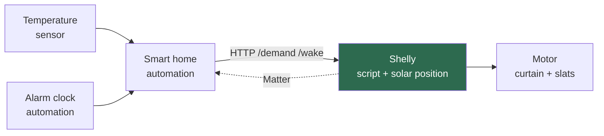
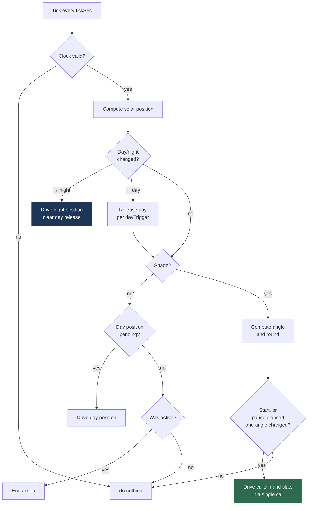
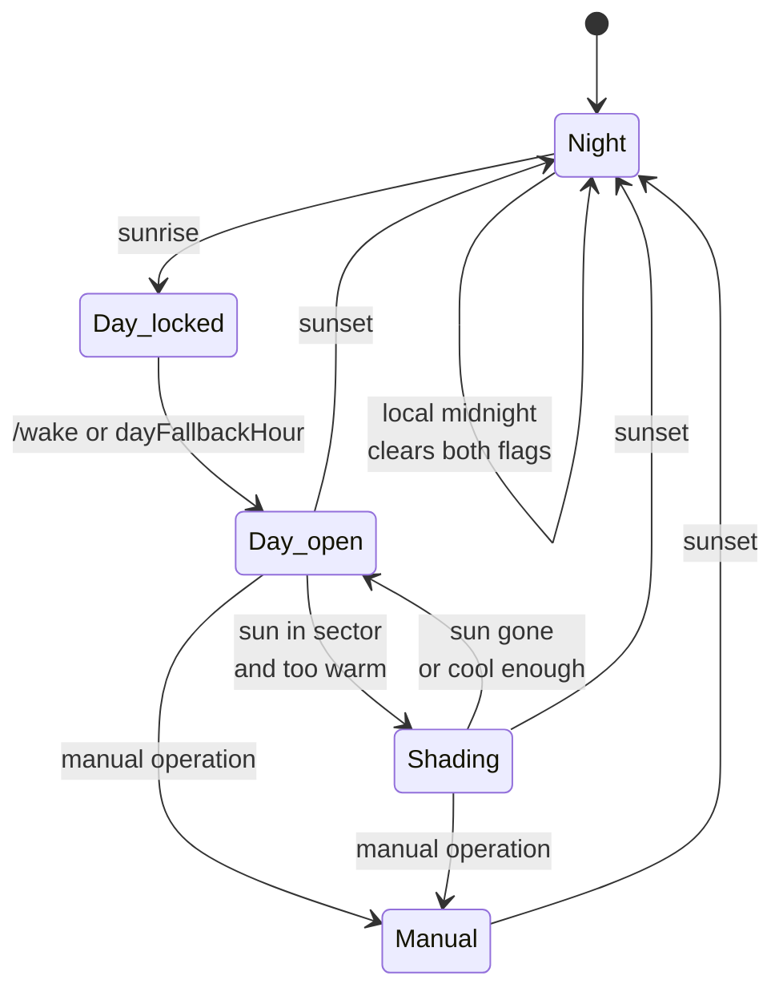

# Shelly Sun Tracking Blinds

Autonomous venetian blind control as a Shelly script. The device computes the solar
position itself, derives the slat angle needed to block direct sunlight, and tracks it
through the day. No server, no broker, no cloud. A network outage does not stop it.

Tested on Shelly Gen2 and newer in the Cover profile.

## Features

- Solar elevation and azimuth from clock and coordinates, without any external service
- Slat angle from slat width, slat distance and window orientation
- Tracking in a configurable angular step, with a minimum pause between movements
- Day and night positions, triggered either by sunrise or by an external wake call
- Manual operation pauses the automation for the rest of the local day
- Heat demand supplied from outside as a plain yes/no over HTTP
- Layered fallbacks for network, hub or time server failures

## Architecture



The Shelly is the only controller. The smart home platform feeds two signals into it
and serves as a remote control. If the dashed link fails, shading keeps running.

## How the angle is derived

**Solar position.** NOAA approximation from the device unix time. The error stays below
0.01 degrees, verified against the theoretical solar elevations at the solstices.

**Profile angle.** The apparent angle of incidence in the window plane, that is, the
angle the sun has from the slat's point of view:

```
p = atan( tan(h) / cos(γ) )
```

where `h` is the solar elevation and `γ` the angle between solar azimuth and window
orientation.

**Cut-off angle.** The flattest slat angle at which the slats still shade each other
for that profile angle:

```
sin(β + p) = (d / w) · cos(p)
```

`w` is the slat width, `d` the distance between two slats. If `d > w` the blind never
closes tightly, and the script clamps to the steepest achievable value.

**Rounding.** The result is rounded to `stepDeg`, always towards closed. Rounding to
the nearest step would let a stripe of sun through on every second step. Rounding one
way also creates half a step of safety margin on average, which absorbs the mechanical
play of the blind.

## Cycle



Shading runs only when all conditions hold: no manual override, day released, heat
demand active, sun inside the window sector and above `minElev`.

## Day cycle



`Day_locked` exists only with `dayTrigger: "cmd"`. In that state the blind stays down
and shading does not engage either, so the morning sun cannot wake anyone. With
`dayTrigger: "sun"` the state is skipped immediately, including when the script starts
up in the middle of a day.

Both the manual override and the day release are stored as local day numbers rather
than as booleans. They therefore expire at local midnight on their own and survive a
reboot without going stale. A side effect worth knowing: a wake call after sunset is
ignored, because the day was already released that morning, while a wake call before
sunrise still works, which is what a winter alarm needs.

If the wake call arrives while shading is already due, the day position is skipped and
the blind goes straight to the shading position. Otherwise it would travel up and back
down seconds later.

## Installation

1. Enable the Cover profile and calibrate the blind
2. Enable slat control and set the tilt time
3. Under *Scripts*, create a new script and paste `shading.js`
4. Adjust the `CFG` block, at minimum coordinates, `azimuth` and the slat dimensions
5. Run the calibration below
6. Start the script and enable *Run on startup*

The script number in the endpoint URLs matches the script ID on the device, so `1` for
the first script.

## Calibration

The one step that cannot be computed, and the one worth doing carefully.

`slat_pos` is not an angle. It is the percentage of tilt travel between the two
mechanical end positions, and which angles those are depends on the blind. A venetian
blind typically closes at 75 to 85 degrees because the slats overlap before reaching
90, and opens only slightly past horizontal on many systems. Polarity depends on the
wiring too, so `slat_pos: 0` may well be the open side.

Procedure:

1. Drive `slat_pos` to 0 in the web interface
2. Place a phone with a spirit level app flat on a slat, note the angle
3. Repeat at `slat_pos` 100
4. Enter the values as `angAtPos0` and `angAtPos100`

Positive means the room-side edge points up. Negative values are fine, the conversion
flips along with them.

A calibration error is systematic and shifts every position in the same direction. No
rounding absorbs it, unlike the mechanical scatter of the blind itself.

## Configuration

| Parameter | Default | Meaning |
|---|---|---|
| `coverId` | `0` | Only relevant on devices with two covers |
| `lat` / `lon` | — | Location in decimal degrees |
| `azimuth` | `180` | Window facing direction, 0=N, 90=E, 180=S, 270=W |
| `tolStart` / `tolEnd` | `85` | Direction tolerance as the sun enters and leaves |
| `minElev` | `5` | Minimum solar elevation for shading |
| `slats` | `true` | `false` for roller shutters without slats |
| `slatWidth` / `slatDist` | `70` / `60` | Slat width and distance in mm |
| `angAtPos0` / `angAtPos100` | `80` / `-10` | Measured end position angles, see calibration |
| `stepDeg` | `15` | Angular step of the tracking |
| `intervalMin` | `20` | Minimum pause between two movements |
| `mode` | `1` | 0 = maximum daylight, 1 = maximum cooling |
| `coolExtra` | `20` | Extra degrees towards closed in mode 1 |
| `shadePos` | `0` | Curtain position while shading |
| `endAction` | `1` | 0=nothing, 1=open, 2=close, 3=slats horizontal |
| `dayTrigger` | `"cmd"` | `"sun"` = sunrise, `"cmd"` = wait for a wake call |
| `dayFallbackHour` | `9` | Local hour at which the blind opens without a wake call |
| `wakeAlwaysOpen` | `false` | `true` = always fully open on wake |
| `sunsetAction` | `true` | Close at sunset |
| `dayPos` / `daySlat` | `100` / `100` | Day position |
| `nightPos` / `nightSlat` | `0` / `0` | Night position |
| `dayNightElev` | `0` | Solar elevation for the day/night switch |
| `demandMaxAgeH` | `24` | Age at which the heat demand counts as lost |
| `fallbackMonths` | `[4..9]` | Months that shade without a valid demand |
| `tickSec` | `300` | Cycle time |
| `debug` | `true` | Output to the script console |

`dayNightElev` may be negative. Around `-4` roughly matches civil twilight, which makes
the blind close later in the evening.

## HTTP endpoints

| Call | Effect |
|---|---|
| `/script/1/demand?v=1` | Too warm, release shading |
| `/script/1/demand?v=0` | Temperature back to normal |
| `/script/1/demand` | Read status only |
| `/script/1/wake` | Release the day |

Every endpoint answers with the current state as JSON, which is convenient for checking
in a browser. A change triggers a cycle immediately, so there is no delay until the
next tick.

## Smart home integration

The examples below use Apple Home, but the principle applies to any platform: the
Shelly is joined over Matter, and **no schedule on the platform may write to the same
cover**. Two controllers on one device mean the script cannot tell an automation apart
from a manual command, and it would lock itself out for the rest of the day.

**Heat demand.** Two automations per room, triggered by the temperature sensor. Above
the upper threshold call `demand?v=1`, below the lower one call `demand?v=0`. The
hysteresis therefore lives in the smart home app and can differ per room. In Apple
Home, extend the automation via *Convert to Shortcut* and use *Get Contents of URL*
there. This runs on the home hub, no phone required.

**Wake call.** A personal shortcut automation triggered by *When my alarm is stopped*,
calling `/wake`. This one runs on the phone. Turn off *Ask Before Running*. For a
device-independent setup, use a fixed-time home automation instead and give up the link
to the actual alarm.

## Autonomy

The design goal is that a single device keeps working when everything else fails.

| Failure | Behaviour |
|---|---|
| Network, hub or phone gone | Shading continues, only without a current heat demand |
| Heat demand older than `demandMaxAgeH` | Falls back to `fallbackMonths`, the season decides |
| No wake call arrives | Opens at `dayFallbackHour` at the latest |
| Power loss | Manual override, heat demand and day release are restored from KVS |
| Clock synchronises late after boot | The restored heat demand is stamped on the first valid tick, not on restore |
| No valid clock after boot | Tracking pauses instead of driving to a wrong position |

## Flash wear

The ESP32 flash tolerates roughly 100,000 write cycles per sector. Only three values are
persisted, namely the ones that cannot be derived again: manual override day, heat
demand and day release. `saveState()` compares against the last written content and writes only
on an actual change. That amounts to a handful of writes per day instead of several
hundred.

Everything else lives in RAM and is back after one cycle at most.

## Notes on the code

mJS is not full JavaScript. Two quirks shape the style:

**Missing math.** Only `sin`, `cos`, `floor`, `ceil`, `round`, `min`, `max`, `pow`,
`exp`, `log` and `random` are available. `atan2`, `atan`, `asin`, `tan`, `sqrt` and `PI`
are implemented in the script itself. `atan2` uses a minimax polynomial with a maximum
error of 0.0001 degrees.

**Small stack.** Expressions are evaluated recursively and deeply nested terms overflow
it. Everything is therefore deliberately flat, using intermediate variables instead of
compact one-liners. It looks clumsy, and it is the reason the script runs at all.

## Known limitations

- No wind or frost protection. With a weather station, add a branch that takes
  precedence over everything else.
- No shading from neighbouring buildings or trees. Raising `minElev` is a crude
  approximation.
- Whether Matter passes the slat angle through to a given controller depends on
  firmware and controller, and should be verified on the actual setup.
- Shelly BLU sensors cannot be added to Apple Home directly. That needs a bridge such
  as Matterbridge or Homebridge.

## Tests

`shading.js` runs unmodified under node against a stub of the Shelly runtime, with a
virtual clock. The suite covers the solar position against the theoretical solstice
elevations, the day release, override and wake behaviour, the movement pacing and the
flash write budget.

```
node test/run.js
```

Every case under day release, manual override and wake call corresponds to a bug that
was found and fixed, so the same mistake cannot come back unnoticed.

## License

MIT.
