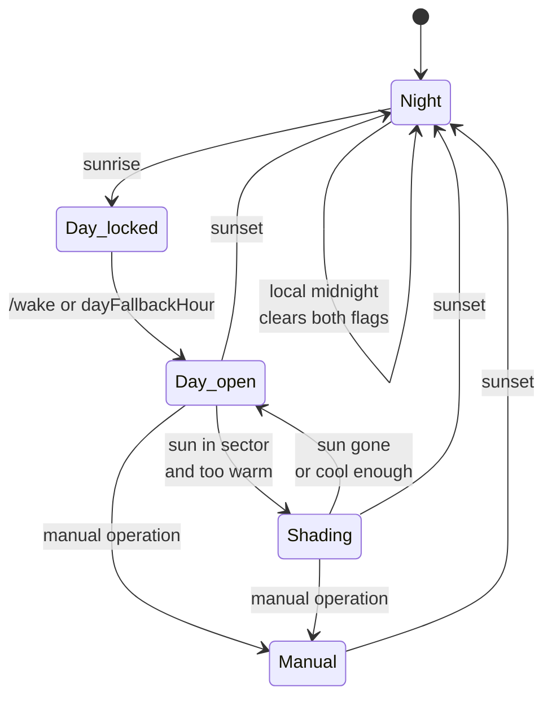

# Shelly Sun Tracking Blinds

Autonomous venetian blind control as a Shelly script. The device computes the solar
position itself, derives the slat angle that blocks direct sunlight, and tracks it
through the day. No server, no broker, no cloud.

Tested on Shelly Gen2 and newer in the Cover profile.

## What it uses

| Input | Comes from | Effect |
|---|---|---|
| **Sun position** | computed on the device, from clock and coordinates | sets the slat angle |
| **Room temperature** | your smart home, via `/demand` | whether to shade at all |
| **Alarm clock** | your smart home, via `/wake` | releases the day, blind opens |
| **Window contact** | your smart home, via `/window` | blocks any downward travel |
| **Manual operation** | the button, app or web interface | pauses automation until midnight |

Only the sun position is required. Every other input is optional, has a fallback, and
reaches the device as a plain yes/no over HTTP. The Shelly stays the only controller:
**no schedule on your smart home platform may write to the same cover**, or the script
cannot tell an automation from a manual command and locks itself out for the day.

## Quick start

1. Enable the Cover profile and calibrate the blind
2. Enable slat control and set the tilt time
3. Under *Scripts*, create a new script and paste [`shading.js`](shading.js)
4. Adjust `CFG`, at minimum coordinates, `azimuth` and the slat dimensions
5. Run the [calibration](#calibration)
6. Start the script and enable *Run on startup*

The `1` in the endpoint URLs is the script ID on the device.

## Calibration

The one step that cannot be computed.


`slat_pos` is a percentage of the tilt travel, not an angle, and the end positions
differ per blind. Polarity too, so `slat_pos: 0` may well be the open side. Measure
once: drive `slat_pos` to 0, lay a phone with a spirit level app on a slat, note the
angle, repeat at 100, enter both as `angAtPos0` and `angAtPos100`.

Worth doing carefully. A calibration error shifts every position the same way, and no
rounding absorbs it.

## Configuration

All settings live in the `CFG` block at the top of the script.

### Location and window


| Parameter | Default | Meaning |
|---|---|---|
| `lat` / `lon` | — | Location in decimal degrees |
| `azimuth` | `180` | Window facing direction, 0=N, 90=E, 180=S, 270=W |
| `tolStart` / `tolEnd` | `85` | Direction tolerance as the sun enters and leaves |
| `minElev` | `5` | Minimum solar elevation for shading |
| `coverId` | `0` | Only relevant on devices with two covers |

### Slats and tracking


| Parameter | Default | Meaning |
|---|---|---|
| `slats` | `true` | `false` for roller shutters without slats |
| `slatWidth` / `slatDist` | `70` / `60` | Slat width `w` and distance `d` in mm |
| `angAtPos0` / `angAtPos100` | `80` / `-10` | Measured end angles, see [calibration](#calibration) |
| `stepDeg` | `15` | Angular step of the tracking |
| `intervalMin` | `20` | Minimum pause between movements, start and end included |
| `mode` | `1` | 0 = maximum daylight, 1 = maximum cooling |
| `coolExtra` | `20` | Extra degrees towards closed in mode 1 |
| `shadePos` | `0` | Curtain position while shading |
| `endAction` | `1` | 0=nothing, 1=open, 2=close, 3=slats horizontal |
| `endSkipDeg` | `8` | End action skipped this close to `dayNightElev`, keep above `minElev` |

### Day and night

| Parameter | Default | Meaning |
|---|---|---|
| `dayTrigger` | `"cmd"` | `"sun"` = sunrise, `"cmd"` = wait for a wake call |
| `dayFallbackHour` | `9` | Opens at this local hour if no wake call arrives |
| `wakeAlwaysOpen` | `false` | `true` = always fully open on wake |
| `sunsetAction` | `true` | Close at sunset |
| `dayPos` / `daySlat` | `100` / `100` | Day position |
| `nightPos` / `nightSlat` | `0` / `0` | Night position |
| `dayNightElev` | `0` | Day/night switch. Negative closes later, `-4` ≈ civil twilight |

### Heat demand and system

| Parameter | Default | Meaning |
|---|---|---|
| `demandMaxAgeH` | `24` | Age at which the heat demand counts as lost |
| `fallbackMonths` | `[4..9]` | Months that shade without a valid demand |
| `tickSec` | `300` | Cycle time |
| `selfCmdSec` | `90` | Window in which a cover report still counts as our own command |
| `debug` | `true` | Output to the script console |

## HTTP endpoints

| Call | Effect |
|---|---|
| `/script/1/demand?v=1` / `?v=0` | Too warm / back to normal |
| `/script/1/wake` | Release the day |
| `/script/1/window?v=1` / `?v=0` | Window open / closed |
| any of them without `?v=` | Read status only |

Each one answers with the current state as JSON and triggers a cycle immediately, so
there is no wait until the next tick.

## Smart home integration

Examples are Apple Home; the principle holds anywhere. Join the Shelly over Matter and
drive the endpoints from your automations.

**Room temperature.** Two automations per room: above the upper threshold call
`demand?v=1`, below the lower one `demand?v=0`. The hysteresis therefore lives in the
app and can differ per room. In Apple Home use *Convert to Shortcut* and *Get Contents
of URL*, which runs on the home hub without a phone.

**Window contact.** One automation per window, opened and closed. Any sensor the
platform can read will do. Shelly BLU sensors need a bridge such as Matterbridge or
Homebridge, they cannot join Apple Home directly.

**Alarm clock.** A personal shortcut automation on *When my alarm is stopped*, calling
`/wake`, with *Ask Before Running* off. This one runs on the phone; a fixed-time home
automation works too but loses the link to the actual alarm.

## How it works

**Solar position.** NOAA approximation from the device unix time, below 0.01 degrees of
error, verified against the theoretical solstice elevations.

**Slat angle.** The profile angle `p` is the sun's apparent angle in the window plane,
from `h` (elevation) and `γ` (azimuth minus window orientation). The cut-off angle `β`
is the flattest slat angle that still shades, see the
[diagram](#slats-and-tracking) above:

```
p = atan( tan(h) / cos(γ) )      sin(β + p) = (d / w) · cos(p)
```

If `d > w` the blind never closes tightly and the script clamps to the steepest value
it can reach.

**Rounding.** Always towards closed, in steps of `stepDeg`. Rounding to the nearest
step would let a stripe of sun through on every second step; rounding one way also
leaves half a step of margin for the mechanical play of the blind.

**When it shades.** Only when all of it holds: no manual override, day released, heat
demand active, window closed, sun inside the sector and above `minElev`.

### Window guard

A blind travelling down into a tilted casement runs its bottom rail into the frame or
the handle. While the window is open, no command that lowers the blind is issued:

- shading does not start, and a running tracking ends
- the sunset position is held back, then driven as soon as the window closes
- of the end actions only `endAction: 1` still runs, because it travels up

Upward movements stay allowed. A contact that was never reported blocks nothing, so a
setup without one behaves as before. If you set `dayPos` to something other than fully
up, that movement is not gated.

### Day cycle



`Day_locked` exists only with `dayTrigger: "cmd"`. The blind stays down and shading
stays off, so the morning sun cannot wake anyone. With `"sun"` the state is skipped.

Manual override and day release are stored as local day numbers, not booleans, so they
expire at midnight on their own and survive a reboot without going stale. Three
consequences:

- A wake call after sunset does nothing, the day was already released that morning. One
  before sunrise still works, which is what a winter alarm needs.
- Manual operation below `dayNightElev` does not pause anything. Otherwise adjusting
  the blind at three in the morning would block the whole coming day.
- A wake call while shading is already due skips the day position, instead of
  travelling up and back down seconds later.

## Autonomy

A single device keeps working when everything else fails.

| Failure | Behaviour |
|---|---|
| Network, hub or phone gone | Shading continues, only without a current heat demand |
| Heat demand older than `demandMaxAgeH` | Falls back to `fallbackMonths`, the season decides |
| No wake call arrives | Opens at `dayFallbackHour` at the latest |
| Power loss | Override, heat demand, day release and window state restored from KVS |
| Clock synchronises late after boot | Restored heat demand is stamped on the first valid tick |
| No valid clock after boot | Tracking pauses instead of driving to a wrong position |
| Window contact stops reporting while open | Blind stays up. No season to fall back on, so it errs towards not moving; `window?v=0` clears it |

## Notes on the code

**Flash wear.** The ESP32 tolerates roughly 100,000 writes per sector. Only what cannot
be derived again is persisted: override day, heat demand, day release, window state.
`saveState()` compares against the last written content, which turns several hundred
writes a day into a handful. Everything else lives in RAM.

**mJS is not full JavaScript.** Only `sin`, `cos`, `floor`, `ceil`, `round`, `min`,
`max`, `pow`, `exp`, `log` and `random` exist, so `atan2`, `atan`, `asin`, `tan`, `sqrt`
and `PI` are implemented in the script. And the stack is small: nested expressions
overflow it, which is why everything is deliberately flat and uses intermediate
variables. It looks clumsy, and it is the reason the script runs at all.

## Tests

`shading.js` runs unmodified under node, against a stub of the Shelly runtime and a
virtual clock.

```bash
node test/run.js
```

Covers the solar position against the theoretical solstice elevations, the day release,
manual override and wake behaviour, the window guard, what survives a reboot, and the
flash write budget.

## Known limitations

- No wind or frost protection. With a weather station, add a branch that takes
  precedence over everything else.
- No shading from neighbouring buildings or trees. Raising `minElev` is a crude
  approximation.
- Whether Matter passes the slat angle through depends on firmware and controller, and
  should be verified on the actual setup.

## License

MIT, see [LICENSE](LICENSE).
